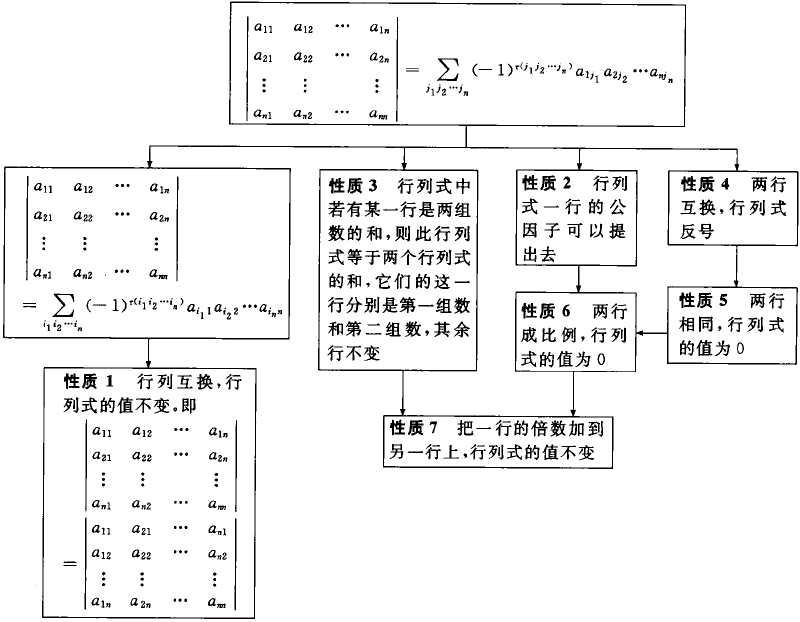

# 丘维声《高等代数》学习笔记

《高等代数》，丘维声，北京大学，视频：共151讲，[B站视频链接](https://www.bilibili.com/video/av39523603)

<!-- TOC depthFrom:1 depthTo:6 withLinks:1 updateOnSave:1 orderedList:0 -->

- [丘维声《高等代数》学习笔记](#丘维声高等代数学习笔记)
	- [前言](#前言)
	- [第一章 线性方程组的解法](#第一章-线性方程组的解法)
		- [1. .1 解线性方程组的矩阵消元法](#1-1-解线性方程组的矩阵消元法)
			- [加减消元法](#加减消元法)
			- [矩阵的初等行变化](#矩阵的初等行变化)
			- [在有理数集内解线性方程组](#在有理数集内解线性方程组)
		- [1.2 线性方程组解的情况及其判别情况](#12-线性方程组解的情况及其判别情况)
		- [1.3 数域](#13-数域)
			- [习题1.3 思路](#习题13-思路)
	- [第二章 行列式](#第二章-行列式)
		- [2.1 n元排列](#21-n元排列)
			- [习题 2.1](#习题-21)
		- [2.2 n阶行列式的定义](#22-n阶行列式的定义)
			- [习题2.2](#习题22)
		- [2.3 行列式的性质](#23-行列式的性质)
			- [习题 2.3](#习题-23)
		- [2.4 行列式按一行（列）展开](#24-行列式按一行列展开)
	- [参考](#参考)

<!-- /TOC -->

## 前言

> 视频1、2

* n元线性方程组和其解法
* 矩阵的定义（由n元线性方程组的系数得到）
  * 通常由 _A_ 表示
  * 对于线性方程组，可以得到**增广矩阵**
* **高等代数研究对象**：
  * **n元线性方程组**
    * 研究**解的情况的判别**和**解集的结构**
  * **矩阵**
  * **n维向量空间**
  * **线性空间**（由n维向量空间抽象而来）
  * **线性映射**（研究线性空间，就离不开线性映射）
  * **双线性函数**
  * **具有度量的线性空间**
    * 欧几里得空间
    * 酉空间
    * 等等
  * **与度量有关的线性变换**
    * 正交变换
    * 对称变换
    * 酉变换
    * Hermite变换
* **线性代数的主线：**
  * 线性空间
  * 线性映射
* 一元高次方程的求根
  * 一元多项式环
  * 环的概念
  * 域的概念
  * 群的概念
* **数学的思维方式**
  * 观察客观现象
    * 提出研究的问题
    * 抓住主要特征
  * 抽象出概念或建立模型
  * 探索
    * 运用直觉、类比、归纳、联想、推理
  * 猜测（可能的规律）
  * 论证
    * 深入分析
    * 运用定义、公理、已证明的定理进行推理
  * 揭示事物内在规律

## 第一章 线性方程组的解法

### 1. .1 解线性方程组的矩阵消元法

> 视频3、4、5

#### 加减消元法

* 不同方程的乘以系数后和其他方程加减，以消除方程中某个（些）系数
* 如果以矩阵方式来写，把矩阵转换为阶梯型矩阵，即左下角的元素全为0
  * 首先针对矩阵第一列，其次第二列，直到最后一列
* 当主元全是1，其他元素都是0 时，增广矩阵的最后一列即为X的解

#### 矩阵的初等行变化

1. 把一行的倍数加到另外一行
2. 两行互换
3. 一行乘以一个非零系数

**结论**：矩阵的初等行变换得到的解与原方程组同解

作业，习题1.1的1和2

#### 在有理数集内解线性方程组

**有且只有如下三种情况：**

* **无解**：阶梯形方程组无解，从而原方程组无解
  * 视频中的例子是最后一行：_0 x<sub>3</sub>= -2_
* **有无穷多个解**，从而原方程有无穷多个解
  * 视频的例子是最后一行：_0 x<sub>2</sub> = 0_
  * _x<sub>2</sub>_ 是自由未知量（主变量以外的未知量）
  * _x<sub>1</sub>, x<sub>3</sub>_ 是主变量（以主元为系数的未知量）
* **有唯一的解**

当有解的时候，要么有一个解，要么有无穷多个解。

> 从两条直线来考虑这个问题，它们要么相交，要么重叠，要么平行。

**方程组是否有解的总结：**

* 如果线性方程的增广矩阵经过初等变换成阶梯矩阵后
  * 相应的阶梯矩阵方程组如果出现 _0 = d_ （其中 _d_ 是非零数），那么原方程组无解，否则有解。
* 当有解时
  * 若阶梯形矩阵的非零行的数目 _r = n_ （未知量数目），那么方程有唯一解
  * 如 _r < n_，那么方程有无穷多个解。

### 1.2 线性方程组解的情况及其判别情况

> 视频5、6

证明：n元线形方程组的增广矩阵经过初等行变换成阶梯矩阵有 _r_ 个非零行，显然有 _n + 1_ 列。

* 情况1： *"0 = d"*，无解
* 情况2： 不出现*"0 = d"*
  * 由于 _J_ 的第 _r_ 个主元 _b<sub>rt</sub>_ 不能位于第 _n+1_ 列，因此 _t ≤ n_
  * 因为只能位于对角线的右上方，所以有 _t ≥ r_
  * 情况 2.1：_r = n_
    * _J<sub>1</sub>_ 有n个主元，最后一列的 _(C<sub>1</sub>, C<sub>2</sub>, ..., C<sub>n</sub>)_ 是方程唯一解
  * 情况 2.2：_r < n_
    * 有 _n - r_个自由未知量

### 1.3 数域

> 视频7

定义1：复数集的一个非空子集K，如果满足：

（1）*0， 1 ∈ K*

（2）*a，b ∈ K* → *a ± b, ab ∈ K*

（3）*a，b ∈ K*，且 *b ≠ 0 → <sup>a</sup>/<sub>b</sub> ∈ K*

上面 *K* 是一个数域

**数域举例：**

- 有理数域 *Q* （最小的数域）
- 实数域 *R*
- 复数域 *C* （最大的数域）

对于例子：

-  _a<sub>11</sub>x1 + a<sub>12</sub>x<sub>2</sub> = b<sub>1</sub>_
- _a<sub>21</sub>x1 + a<sub>22</sub>x<sub>2</sub> = b<sub>2</sub>_

其增广矩阵转化为阶梯矩阵后可得

$$
\begin{pmatrix} a_{11} & a_{12} & b_1\\ 0 & a_{22} - \frac{a_{21}}{a_{11}}a_{12} & b_2 - \frac{a_{21}}{a_{11}}b_1 \end{pmatrix}
$$


所以需要第二行第二个元素部位*0*，意味着

* _(<sup> a<sub>11</sub>a<sub>22</sub> - a<sub>21</sub>a<sub>12</sub> </sup>/<sub> a<sub>11</sub> </sub>) ≠ 0_，即
* _a<sub>11</sub>a<sub>22</sub> - a<sub>21</sub>a<sub>12</sub> ≠ 0_

表达式_a<sub>11</sub>a<sub>22</sub> - a<sub>21</sub>a<sub>12</sub> ≠ 0_ 用  _|A|_ 来表示，称为**行列式**，这里是**二阶行列式**

#### 习题1.3 思路

1. 令 *Q(i) = {a + bi | a, b ∈ Q}*, 证明 *Q(i)* 是一个数域

证明思路：

* 0 = 0 + 0i ∈ Q(i), 1 = 1 + 0 i ∈ Q(i)
* α = a + bi, β = c + di
  - α ± β = (a ± c) + (b ± d)i ∈ Q(i)
  - αβ = (ac - bd) + (ad + bc)i ∈ Q(i)
  - β ≠ 0，则c、d不全为0，则$ \frac{\alpha}{\beta} = \frac{a+bi}{c+di} = \frac{(a+bi)(c-di)}{(c+di)(c-di)}=\frac{ac+bd}{c^2+d^2}+\frac{(bc-ad)}{c^2+d^2}i \in Q(i) $

2. 令 $F=\{\frac{a_0+a_1e+\cdots+a_ne^n}{b_0+b_1e+\cdots+b_ne^n}$ ，n、m为任意非负整数，a<sub>i</sub>，b<sub>i</sub> 数域 Z，0 ≤ i ≤ n, 0 ≤ j ≤ m。证明F是一个数域，其中e是自然对数的底。

证明思路：

* 对于 0、1∈ F的思路同上题目
* 对于F中的两个数 α、β
  * 令$\alpha=\frac{a_0+a_1e+\cdots+a_{n_\alpha}e^{n_\alpha}}{b_0+b_1e+\cdots+b_{n_\alpha}e^n_{n_\alpha}}, \beta=\frac{a_0+a_1e+\cdots+a_{n_\beta}e^{n_\beta}}{b_0+b_1e+\cdots+b_{n_\beta}e^n_{n_\beta}}$
  * 则 $\alpha\beta=\frac{a_0^2+2a_0a_1e+\cdots+a_{n_\alpha}a_{n_\beta}e^{n_\alpha+n_\beta}}{b_0^2+2b_0b_1e+\cdots+b_{n_\alpha}b_{n_\beta}e^n_{n_\alpha+n_\beta}}$，所以 αβ ∈ F
  * 同样的思路 α ± β ∈ F，<sup>α</sup>/<sub>β</sub> ∈ F

## 第二章 行列式

先研究属于 _K_ 上二元一次方程组，例子：

- _a<sub>11</sub>x1 + a<sub>12</sub>x<sub>2</sub> = b<sub>1</sub>_
- _a<sub>21</sub>x1 + a<sub>22</sub>x<sub>2</sub> = b<sub>2</sub>_

在 1.3节中讨论过 当 _a<sub>11</sub>a<sub>22</sub> - a<sub>21</sub>a<sub>12</sub> ≠ 0_时方程有唯一解；_a<sub>11</sub>a<sub>22</sub> - a<sub>21</sub>a<sub>12</sub> = 0_是有无穷多个解，为了方便记忆，把表达式 _a<sub>11</sub>a<sub>22</sub> - a<sub>21</sub>a<sub>12</sub>_写作：

$$
\left|\begin{array}{ll}{a_{11}} & {a_{12}} \\ {a_{21}} & {a_{22}}\end{array}\right|=a_{11}a_{22}-a_{12}a_{21}
$$

这是**2阶行列式**。把系数矩阵记作_A_，那么它对应的行列式记作 _|A|_ 或 det(A)。

**数域 _K_ 上的系数矩阵 _A_ 有唯一解 <==> _|A| ≠ 0_**

### 2.1 n元排列

_**n_元排列**：_1, 2, ..., n_ 的一个全排列。排列个数有 _n!_ 个。

**排列方法**：

1. **顺序**：数字从小到大排列（对 a<sub>1</sub>, a<sub>2</sub>, ..., a<sub>n</sub>，任取一对数_a<sub>i</sub>a<sub>j</sub>_，如果_a<sub>i</sub><a<sub>j</sub>_，则称这一对数构成一个顺序
2. **逆序**：数字从大到小排列（对 a<sub>1</sub>, a<sub>2</sub>, ..., a<sub>n</sub>，任取一对数_a<sub>i</sub>a<sub>j</sub>_，如果_a<sub>i</sub>>a<sub>j</sub>_，则称这一对数构成一个逆序

**逆序数**：一个 _n_ 元排列中逆序的总数称为**逆序数**，记作_**τ(a<sub>1</sub>, a<sub>2</sub>, ..., a<sub>n</sub>)**_。

* 例如_τ(2431) = 2_，因为有24、31这两个逆序数对。

**偶（奇）排列：**逆序数个数为偶（奇）数，那么这个排列称为**偶（奇）排列**。

**对换：**一个排列里的两个数字互换位置，称为一次**对换**。

**定理1：对换会改变数列奇偶性。**

**定理2：任一n元排列与排列123...n可经过一系列对换互变，并且所做对换的次数与这个n元排列有相同的奇偶性。**

#### 习题 2.1

2\. (1) $\tau = \frac{(n-1)(n-2)}{2}$, (2) $\tau=n-1$
4\. (1) k - 2, (2) n - k - 1
6\. $|A| = 2*4 + 15 = 23$，因此有唯一解$x_1 = 2, x_2 = -1$


### 2.2 n阶行列式的定义

定义1：n阶行列式

$$
\left|
\begin{array}{cccc}
{a_{11}} & {a_{12}} & {\cdots} & {a_{1n}} \\
{a_{21}} & {a_{22}} & {\cdots} & {a_{2n}} \\
{\vdots} & {\vdots} &  & {\vdots} \\
{a_{n1}} & {a_{n2}} & {\cdots} & {a_{mn}}
\end{array}
\right|
= \sum_{j_1j_2\vdots j_n}(-1)^{\tau(j_1j_2\cdots j_n)}a_{1j_1}a_{2j_2}\cdots a_{nj_n}
$$

简记作$|A|$或 $\mathbb{det} A$。

**命题1**：n阶上三角形行列式的值等于它的主对角线上n个元素的乘积。

#### 习题2.2

2\. (1) -49, (2) 103, (3) $a_{11}a_{22}a_{33}$, (4) $ca_1b_2 - ca_2b_1$

可以用下面的Python代码来验证结果：

``` python
import numpy as np
A = np.array([[1, 4, 2],[3, 5, 1],[2, 1, 6]])
print(np.linalg.det(a))
```

4\. 不是

5\. 四次，5和5

6\. 如果元素相同，|A| = 0，为偶数

### 2.3 行列式的性质

> [视频12](https://www.bilibili.com/video/av39523603/?p=12)

**性质1**：行列互换（矩阵转置），行列式的值不变。
$$
|A| = |A^T|
$$

**性质2**：行列式一行的公因子可以提出去。即为
$$
\left| \begin{array}{cccc}{a_{11}} & {a_{12}} & {\cdots} & {a_{1 n}} \\ {\vdots} & {\vdots} &  & {\vdots} \\ {k a_{i 1}} & {k a_{i 2}} & {\cdots} & {k a_{i n}} \\ {\vdots} & {\vdots} &  & {\vdots} \\ {a_{n 1}} & {a_{n 2}} & {\cdots} & {a_{nn}}\end{array}\right|=k \left| \begin{array}{cccc}{a_{11}} & {a_{12}} & {\cdots} & {a_{1 n}} \\ {\vdots} & {\vdots} &  & {\vdots} \\ {a_{i 1}} & {a_{i 2}} & {\cdots} & {a_{i n}} \\ {\vdots} & {\vdots} &  & {\vdots} \\ {a_{n 1}} & {a_{n 2}} & {\cdots} & {a_{nn}}\end{array}\right|
$$

**性质3**：行列式中若有某一行是两组数的和，则此行列式等于两个行列式的和，这两个行列式的这一行分别是第一组数和第二组数，而其余各行于原来行列式的相应各行相同，即
$$
\left| \begin{array}{cccc}{a_{11}} & {a_{12}} & {\cdots} & {a_{1 n}} \\ {\vdots} & {\vdots} &  & {\vdots} \\ {b_{1} + c_1} & {b_{2}+c_2} & {\cdots} & {b_{n}+c_n} \\ {\vdots} & {\vdots} &  & {\vdots} \\ {a_{n 1}} & {a_{n 2}} & {\cdots} & {a_{nn}}\end{array}\right|=\left| \begin{array}{cccc}{a_{11}} & {a_{12}} & {\cdots} & {a_{1 n}} \\ {\vdots} & {\vdots} &  & {\vdots} \\ {b_{1}} & {b_{2}} & {\cdots} & {b_{n}} \\ {\vdots} & {\vdots} &  & {\vdots} \\ {a_{n 1}} & {a_{n 2}} & {\cdots} & {a_{nn}}\end{array}\right| + \left| \begin{array}{cccc}{a_{11}} & {a_{12}} & {\cdots} & {a_{1 n}} \\ {\vdots} & {\vdots} &  & {\vdots} \\ {c_1} & {c_2} & {\cdots} & {c_n} \\ {\vdots} & {\vdots} &  & {\vdots} \\ {a_{n 1}} & {a_{n 2}} & {\cdots} & {a_{nn}}\end{array}\right|
$$

**性质4**：两行互换，行列式反号，即
$$
\left|\begin{array}{cccc}{a_{11}} & {a_{12}} & {\cdots} & {a_{1 n}} \\ {\vdots} & {\vdots} &  & {\vdots} \\ {a_{i 1}} & {a_{i 2}} & {\cdots} & {a_{i n}} \\ {\vdots} & {\vdots} & & {\vdots} \\ {a_{k 1}} & {a_{k 2}} & {\cdots} & {a_{k n}} \\ {\vdots} & {\vdots} &  & {\vdots} \\ {a_{n 1}} & {a_{n 2}} & {\cdots} & {a_{m}}\end{array}\right| = -
\left| \begin{array}{cccc}{a_{11}} & {a_{12}} & {\cdots} & {a_{1 n}} \\ {\vdots} & {\vdots} &  & {\vdots} \\ {a_{k 1}} & {a_{k 2}} & {\cdots} & {a_{k n}} \\ {\vdots} & {\vdots} &  & {\vdots} \\ {a_{i 1}} & {a_{i 2}} & {\cdots} & {a_{i n}} \\ {\vdots} & {\vdots} &  & {\vdots} \\ {a_{n 1}} & {a_{n 2}} & {\cdots} & {a_{m}}\end{array}\right|
$$

**性质5**：两行相同，行列式的值为0。即
$$
\left|\begin{array}{cccc}{a_{11}} & {a_{12}} & {\cdots} & {a_{1 n}} \\ {\vdots} & {\vdots} &  & {\vdots} \\ {a_{i 1}} & {a_{i 2}} & {\cdots} & {a_{i n}} \\ {\vdots} & {\vdots} & & {\vdots} \\ {a_{i 1}} & {a_{i 2}} & {\cdots} & {a_{i n}} \\ {\vdots} & {\vdots} &  & {\vdots} \\ {a_{n 1}} & {a_{n 2}} & {\cdots} & {a_{m}}\end{array}\right| = 0
$$

**性质6**：两行成比例，行列式的值为0。

**性质7**：把一行的倍数加到另一行上，行列式的值不变。（根据性质3和性质5可以证明）

上述七个行列式性质可以总结为如下的图：



#### 习题 2.3

2\. (1) $(a + n-1)(a - 1)^{n-1}$，思路为把所有行加到第一行，第一行的每一个元素相同，可以提取出一个倍数$(a+n-1)$，第一行元素全为1，再把所有行减去第一行，因此仅剩右对角线上元素为$a-1$，可得

2\. (2)  $\left((\sum_{i=1}^na_i)-b\right)(-b)^{(n-1)}$，同上，把所有的列加到第一列

3\. (1) 所有列相加得0，所以为0

3\. (2) 利用性质7，做列的加减

4\. (1) $a_1 - \sum_{i=2}^{n}a_ib_i$，利用性质7做列加减，让第一列除了第一个元素外其他元素都为0

4\. (2) 0，利用性质3，把第一行的每个元素拆分为2个，因此有两个行列式，发现两个行列式的除了第一行外都成比例，根据性质6，分别为0。

### 2.4 行列式按一行（列）展开

> [视频14](https://www.bilibili.com/video/av39523603/?p=14)

**定义1**：n阶行列式$|A|$中，花去第$i$行和第$j$列，剩下的元素按原来次序组成的$n-1$阶行列式称为矩阵$A$的$(i, j)$的**余子式**，记作$M_{ij}$。令
$$
A_{ij} = (-1)^{i+j}M_{ij}
$$

称为$A_{ij}$是$A$的$(i, j)$的**代数余子式**。

对于一个$n=3$的矩阵有，$|A| = a_{11}A_{11}+a_{12}A_{12}+a_{13}A_{13}$，可以推广得到

**定理1**：n阶行列式$|A|$等于它的第$i$行元素与自己的代数余子式的乘积之和，即
$$
|A| = \sum_{j=1}^{n} a_{ij}A_{ij}
$$

**定理2**：n阶行列式$|A|$等于它的第$j$列元素与自己的代数余子式的乘积之和，即
$$
|A| = \sum_{l=1}^{n} a_{lj}A_{lj}
$$

**定理3**：n阶行列式$|A|$的第$i$行元素与第$k$行相应元素的**代数余子式**的乘积之和等于0，即
$$
a_{i1}A_{k1}+a_{i2}A_{k2}+\cdots+a_{in}A_{kn}=0，当k\neq i.
$$

**定理4**：n阶行列式$|A|$的第$j$列元素与第$l$列（$l \neq j$）相应元素的**代数余子式**的乘积之和等于0，即
$$
a_{1j}A_{1l}+a_{2j}A_{2l}+\cdots+a_{nj}A_{nl}=0，当l\neq i.
$$

**范德蒙行列式**：
$$
\left| \begin{array}{ccccc}{1} & {1} & {1} & {\cdots} & {1} \\ {a_{1}} & {a_{2}} & {a_{3}} & {\cdots} & {a_{n}} \\ {a_{1}^{2}} & {a_{2}^{2}} & {a_{3}^{2}} & {\cdots} & {a_{n}^{2}} \\ {\vdots} & {\vdots} & {\vdots} & { } & {\vdots} \\ {a_{1}^{n-2}} & {a_{2}^{n-2}} & {a_{3}^{n-2}} & {\cdots} & {a_{n}^{n-2}} \\ {a_{1}^{n-1}} & {a_{2}^{r-1}} & {a_{3}^{n-1}} & {\cdots} & {a_{n}^{n-1}}\end{array}\right|
= \prod_{1 \leq j<i \leq n}\left(a_{i}-a_{j}\right)
$$

### 2.5 克莱姆法则

**定理1**：数域K上n个方程的n元线性方程组有唯一解的充分必要条件是它的系数行列式（即系数矩阵A的行列式$|A|$）不等于0。

**推论1**：数域K上n个方程的n元齐次线性方程组只有零解的充分必要条件是它的系数行列式不等于0.它有非零解的充分必要条件是它的系数行列式等于0。


## 参考

1. [数学学习小组](https://github.com/yuerYDP/Math_learning_group)

[回到顶部](#丘维声高等代数学习笔记)
